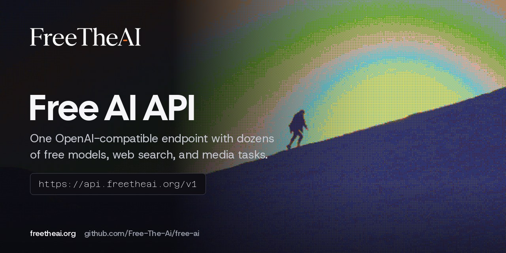

<p align="center">
  <a href="https://freetheai.org"></a>
</p>

<p align="center">
  <a href="https://freetheai.org"></a>
  <a href="https://freetheai.org/docs"></a>
  <a href="https://freetheai.org/models"></a>
  <a href="LICENSE"></a>
  <a href="https://discord.gg/secrets"></a>
</p>

<p align="center">
  <b><a href="https://freetheai.org/docs">Docs</a></b> ·
  <a href="https://freetheai.org/setup">Setup guides</a> ·
  <a href="https://freetheai.org/models">Models</a> ·
  <a href="https://freetheai.org/checkin">Daily check-in</a> ·
  <a href="https://freetheai.org/status">Status</a> ·
  <a href="https://discord.gg/secrets">Discord</a>
</p>

# FreeTheAI

FreeTheAI is a free, OpenAI-compatible AI API. One key and one base URL give you dozens of chat models with streaming, tool calling, web search with sourced answers, and image and video generation. Also searched as *Free The AI*, *Free The Ai*, and *FreeTheAi*.

> [!IMPORTANT]
> FreeTheAI moved to [freetheai.org](https://freetheai.org). The old API at `api.freetheai.xyz`, its keys, and the old Discord `/signup` and `/checkin` commands no longer work. Use the base URL `https://api.freetheai.org/v1` with a key from freetheai.org. Old `freetheai.xyz` links forward to their new pages.

## Quick start

1. Create an account at [freetheai.org](https://freetheai.org), confirm your email, and make a key under [API keys](https://freetheai.org/dashboard/api-keys).
2. Do the [daily check-in](https://freetheai.org/checkin) once a day to unlock the free models until 00:00 UTC.
3. Point your app at the base URL.

```
Base URL    https://api.freetheai.org/v1
Auth        Authorization: Bearer YOUR_API_KEY
Model IDs   fta/<provider>/<model>, for example fta/zai/glm-5.3
```

```bash
curl https://api.freetheai.org/v1/chat/completions \
  -H "Authorization: Bearer $FREETHEAI_API_KEY" \
  -H "Content-Type: application/json" \
  -d '{"model": "fta/zai/glm-5.3", "messages": [{"role": "user", "content": "Hello!"}]}'
```

```python
from openai import OpenAI

client = OpenAI(base_url="https://api.freetheai.org/v1", api_key="YOUR_API_KEY")
reply = client.chat.completions.create(
    model="fta/zai/glm-5.3",
    messages=[{"role": "user", "content": "Hello!"}],
)
print(reply.choices[0].message.content)
```

Chat completions support streaming, tool calling, and the usual sampling settings. List the models your key can use with `GET /v1/models`. Every error carries an error ID (in the body and the `X-Error-ID` header); quote it when you ask for help.

## SDKs and examples

| Language | Package | Repository |
| :--- | :--- | :--- |
| Python | `pip install freetheai` | [freetheai-python](https://github.com/Free-The-Ai/freetheai-python) |
| JavaScript and TypeScript | `npm install freetheai` | [freetheai-js](https://github.com/Free-The-Ai/freetheai-js) |
| Go | `go get github.com/Free-The-Ai/freetheai-go` | [freetheai-go](https://github.com/Free-The-Ai/freetheai-go) |
| Recipes for all of the above | | [freetheai-cookbook](https://github.com/Free-The-Ai/freetheai-cookbook) |

Code you can copy is in [`examples/`](examples/README.md).

## Free tier

- **50 requests a day** on the free models. The count resets at 00:00 UTC, and failed requests don't count.
- Free models need the **daily check-in** at [freetheai.org/checkin](https://freetheai.org/checkin).
- Paid plans are coming soon.

## Models

The live list, with context sizes, is at [freetheai.org/models](https://freetheai.org/models). Model IDs start with a short tag:

| Prefix | What it holds |
| :--- | :--- |
| `fta/zai/*` | GLM models, including `glm-5.3` and `glm-5.3-flash` |
| `fta/kimi/*` | Kimi K3 |
| `fta/mmx/*` | MiniMax M3 |
| `fta/bbl/*`, `fta/vbk/*`, `fta/olm/*`, `fta/olf/*`, `fta/kai/*`, `fta/ocz/*` | Chat, reasoning, and open-weight models, some with free tiers |

## Apps and setup guides

Anything that speaks the OpenAI API works with FreeTheAI, including SillyTavern, JanitorAI, Open WebUI, Cline, LibreChat, and more. Step-by-step guides for each app are at [freetheai.org/setup](https://freetheai.org/setup).

## Privacy

Read the [Terms](https://freetheai.org/terms) and the [Privacy Policy](https://freetheai.org/privacy) for what is collected and who is responsible for it.

## For AI agents

[`SKILL.md`](SKILL.md) teaches coding agents how to set up FreeTheAI in a user's tools without inventing keys, endpoints, or model IDs.

## This repository

- [`examples/`](examples/README.md) holds copy-paste code for common SDKs.
- [`site/`](site/) is the small Astro site that forwards the old `freetheai.xyz` links to [freetheai.org](https://freetheai.org). It deploys to GitHub Pages on every push to `master`.

## Support and credits

FreeTheAI is built by [Vibhek Soni](https://vibheksoni.com) ([@vibheksoni](https://github.com/vibheksoni)). A tip on [Buy Me a Coffee](https://buymeacoffee.com/vibheksoni) helps cover the servers. Starring the repo and sharing it helps too.

- Questions and help: [Discord](https://discord.gg/secrets)
- Security issues: vibheksoni@engineer.com

## License

MIT. See [LICENSE](LICENSE).
